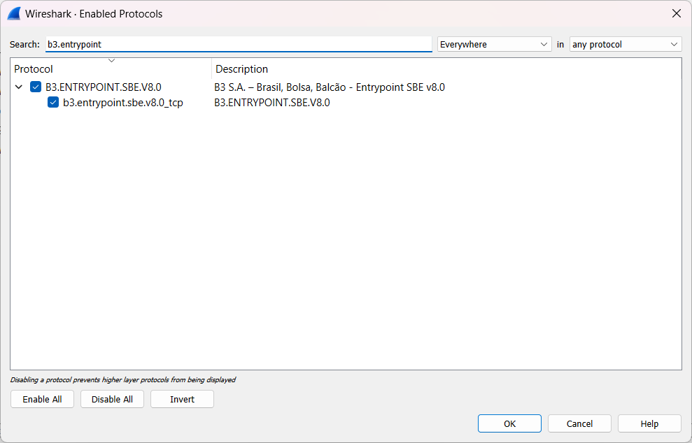

# Wireshark Plugin - B3 SBE Message Decoding
This Wireshark plugin allows you to decode SBE (Simple Binary Encoding) messages from the B3 order entry gateway. It provides a convenient way to analyze and interpret the network traffic between the B3 gateway and your application.

## Features
- Decodes SBE messages transmitted over the network.
- Displays decoded message fields in a human-readable format.
- Supports both inbound and outbound messages.
- Provides detailed information about each message field.
- Supports multiple template versions.

## Installation
1. Download the plugin `plugins/b3.entrypoint.sbe.wireshark.plugin.lua`
2. Copy the plugin binary to the Wireshark plugins directory.
    - On Windows: `<Wireshark Install Directory>/plugins`. If portable `<Wireshark Install Directory>/data/plugins`
    - On macOS: `/Applications/Wireshark.app/Contents/PlugIns`.
    - On Linux: `/usr/lib/wireshark/plugins`.
3. Launch Wireshark and verify that the plugin is loaded. You should see the "B3.ENTRYPOINT.SBE" 

## Contributing
Contributions to this Wireshark plugin are welcome. If you encounter any issues or would like to add new features, please open an issue or submit a pull request.

Feel free to modify this template to suit your specific needs. Let me know if you need any further assistance!
